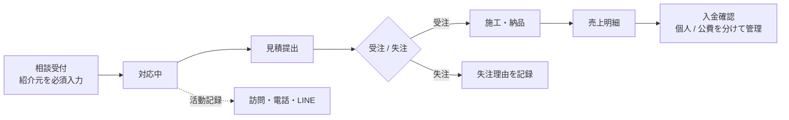
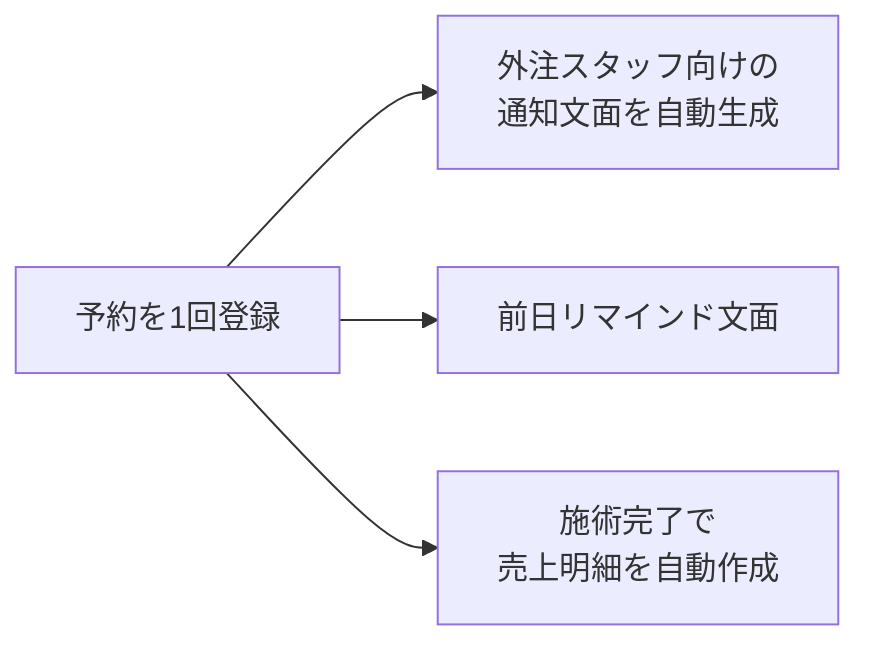

# 介護用品レンタル会社の業務改善・DX

`Case Study` ｜ 期間：2026-09〜（要件定義・設計フェーズ） ｜ 役割：現状分析・ヒアリング・要件定義・設計・導入計画

> 本ドキュメントはクライアント名・所在地・従業員名・売上などの社内数値を伏せたケーススタディです。コードを書いたことではなく、**現状分析から導入計画までの進め方**を示すために掲載しています。

## 概要

介護保険の福祉用具レンタルを本業に、住宅改修や物販などの関連サービスも行う介護事業者の業務改善プロジェクトです。顧客・案件・売上・勤怠などの情報が、複数のスプレッドシート・個人のExcel・カレンダー・LINE・社内NAS・個人ごとのGoogleアカウントに分散していた状態を整理し、業務システムの要件定義・設計・導入計画を作りました。

## 背景 / 課題

ヒアリングと既存データの確認でわかった主な課題です。

- **顧客IDや「案件」の概念がない**：売上表の顧客は自由入力の氏名で、同じ人が別表記で入っている
- **集計が手作業**：「今月の工事は何件か」を、社長が明細を一つずつ数えている
- **案件が途中で途切れる**：営業 → 発注 → 施工 → 入金の流れが共有されず、入金が来てから事務が「これは誰の案件か」を確認している
- **外注スタッフが担当する訪問サービスの予約で三重入力**：個人のExcel・売上表・カレンダーに同じ内容を入力している
- **紹介元のデータが途中から記録されていない**：紹介元（ケアマネジャー）別の分析ができない
- **以前導入したExcelツールが定着しなかった**：電話番号検索などの機能はあったが、使われないまま止まっていた
- **本業のレンタルは専用システムで管理**：こちらは置き換えの対象外

## 利用者

| 立場 | 主な要求 |
| --- | --- |
| 社長（営業も兼務） | 会社全体を1画面で見て指示を出したい。担当別・分類別の売上と目標達成率を月末を待たずに見たい |
| 事務 | 三重入力をなくしたい。着信番号の下4桁で顧客を探し、履歴を一画面で見たい。入金がどの案件か分かるようにしたい |
| 営業（福祉用具専門相談員） | 自分の数字を自分で見たい。訪問・電話などの活動を簡単に記録したい |
| 外注スタッフ（施工・訪問サービス） | 予約・変更・前日の連絡が確実に届くこと |

## 自分の役割 / 担当範囲

業務改善の伴走者として、次の工程を担当しています。v1 の実装も担当する予定です。

| 工程 | 内容 |
| --- | --- |
| 提案 | 経営層向けのDX提案資料（3版まで改訂） |
| 現状分析 | 会議の録音文字起こし（複数の端末で録音したもの）と既存スプレッドシート・Excelの突き合わせ |
| ヒアリング整理 | 立場別の要求の整理、効率化と生産性向上の切り分け |
| 業務フロー整理 | 現状の手作業のつなぎ目の特定、あるべき流れの設計 |
| 要件定義 | v1 / v1.5 / 対象外の範囲定義、機能ごとの「なぜv1か」 |
| システム設計 | データモデル、画面、権限、移行方法、技術構成の比較 |
| 導入計画 | 90日の計画、並行運用、リスクと対策 |

## 課題をどう整理したか

1. **一次資料で確認する**
   計画書の記述すべてに「資料で確認済み / 複数資料からの強い推定 / 仮定 / 要確認」のラベルを付け、推測と事実を分けました。同じ会議を複数の端末で録音した文字起こしは、同じ箇所を照合して誤りを補正しました。
2. **手作業のつなぎ目を特定する**
   「月末の手転記」「入金後に案件を知る」「三重入力」「手作業の集計」「顧客検索」など、人が手でつないでいる箇所を一つずつ洗い出しました。
3. **立場ごとに要求を分ける**
   社長・事務・営業・外注・外部関係者（ケアマネジャーなど）ごとに、要求とその根拠（会議のどの発言か）を表にしました。
4. **提案時の仮説を見直す**
   提案資料で置いた仮説と、会議・データで分かった事実を並べ、計画をどう変えるかを明示しました。
5. **以前のツールが定着しなかった理由を分析する**
   失敗の原因は機能ではなく、スプレッドシートとの二重管理、運用ルールの未設計、電話中に使えない操作性、古いPC、導入時期、伴走不足が重なったことだと整理しました。

計画書は現状分析・要件・v1範囲・データモデル・業務フロー・権限・KPI・移行・技術構成・ロードマップ・未確定事項など、18本（全体計画を含む）のドキュメントに分けて管理しています。

## 主な意思決定

| 判断 | 理由 |
| --- | --- |
| 提案段階では「まず Google Workspace などのIT環境を整える」を第1段階にしていたが、v1 はWorkspaceに依存しない設計に変更し、IT環境の整理は並行課題にした | 会議で「Workspaceだけでは解決しない」ことを確認し、導入も未確定だったため |
| レンタル専用システムは置き換えず、利用者マスタとレンタル実績を取り込む | 介護保険の請求などは専用システムの領域で、置き換えるリスクが大きいため |
| 顧客マスタの確立と名寄せを v1 の最初の仕事にする | 顧客IDがないと、履歴・案件・集計のすべてが成り立たないため |
| 合格基準を「機能がある」ではなく「説明なしで使える」にし、スプレッドシートを閲覧専用にする日から逆算する | 以前のツールが定着しなかった原因への対策 |
| KPIは紹介元の記録を業務に組み込んでから始め、最初の3か月は4指標に絞る | データが揃わないまま数字を出すと、数字が信用されなくなるため |
| 勤怠は現行ロジックの忠実な置き換えに留め、打刻の導入は社会保険労務士の確認後 | 勤怠は労務と密接で、安易な変更はリスクになるため |
| 技術構成は、ローコード・スプレッドシート継続・BaaS などを比較したうえで、TypeScript の Web アプリ＋PostgreSQL＋VPS を第一候補に | 月額費用が固定で、帳票・取込・集計を自由に書け、データを自社で管理できるため |

## システム / 業務設計

**v1 の範囲（抜粋）**

| 区分 | 内容 |
| --- | --- |
| v1 に入れる | 顧客マスタと電話番号下4桁検索・横断履歴、ケアマネジャー・事業所マスタ、売上明細（入金・仕入を構造化）、担当×分類×月の集計・目標・達成率、最小限の案件と活動記録、訪問サービスの予約・通知文面・売上の自動作成、勤怠の置き換え、権限、レンタル専用システムからの取込、役割別ダッシュボード、過去データの移行 |
| v1.5 で検討 | 写真・ファイル添付、見積書・請求書PDF、カレンダー連携、QR打刻、LINE での自動通知 |
| 入れない | 着信連携（CTI）、Workspace 前提の機能、給与計算、AI機能、フランチャイズ向けの複数社対応 |

**案件の流れ（あるべき姿）**

**訪問サービスの流れ（三重入力の解消）**

## 導入・運用（計画）

| 時期 | 到達点 |
| --- | --- |
| 1か月目 | 計画の確認、未確定事項の回答、既存データの入手、技術構成の決定、名寄せの一致率レポート |
| 2か月目 | 入力ルールの合意（紹介元・仕入・入金）、実データを使ったプロトタイプ（顧客検索・顧客画面・売上入力・集計）の提示 |
| 3か月目 | v1.0 の開発、訪問サービスの先行試用、勤怠仕様の専門家確認 |
| 4〜5か月目 | 本番移行と集計の突き合わせ、並行運用、営業向けの説明 → 本運用 |

主なリスクと対策：データ品質（移行時に要確認データを可視化し、必須入力で止血）、事務担当者への負荷集中（確認作業を短い単位に分割）、一人で開発・保守する持続性（標準的な技術・エクスポート機能・ドキュメントで資産を顧客側に残す）。

## 成果

現時点では導入前のため、業務上の成果はまだありません。成果物は次のとおりです。

- 経営層向けのDX提案資料（3版）
- 現状分析・要件・v1範囲・データモデル・業務フロー・権限・移行・技術構成・ロードマップなど18本（全体計画を含む）の計画ドキュメント
- 提案時の仮説と、会議・データで分かった事実の差分表

## 現在の状態

要件定義・設計フェーズ（2026-09時点）。プロトタイプの作成に向けて、未確定事項の確認と既存データの入手を進めています。

## 公開可能な画面・リンク

- 提案資料・計画書はクライアントの社内情報を含むため非公開
- 公開用に、匿名化した業務フロー図・v1範囲の一枚資料を作成予定

## セキュリティ / 非公開情報について

- クライアント名・所在地・従業員名・売上などの社内数値・利用者の個人情報（要介護度・住所など）は掲載していません
- 既存データの分析は、クライアントから預かった資料の範囲で行っています
