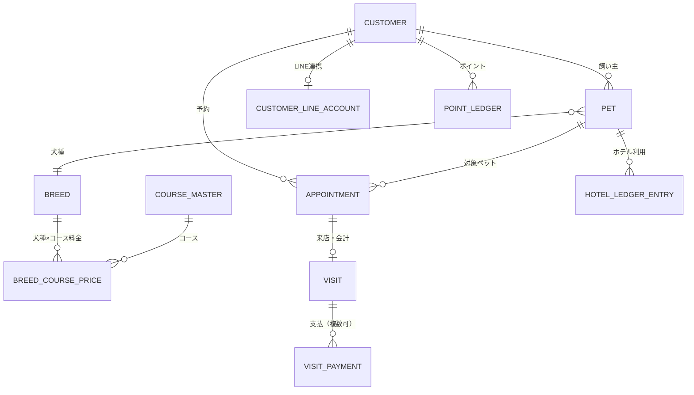
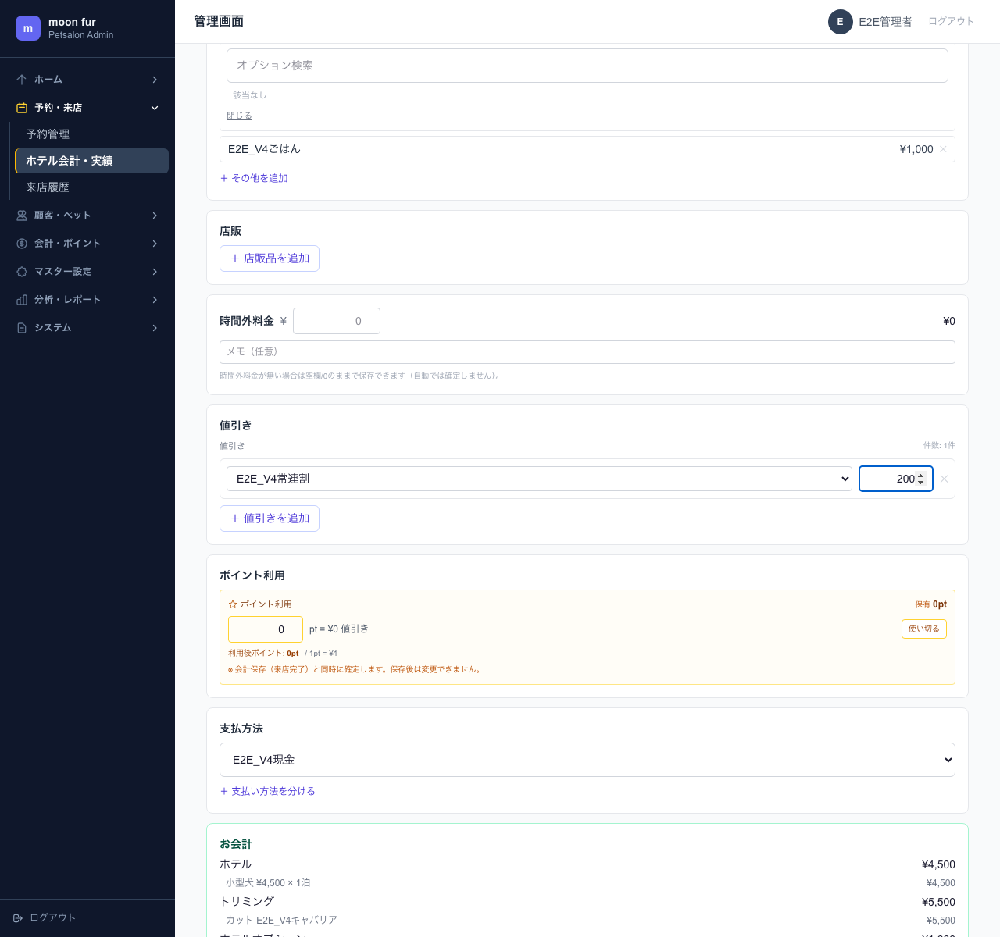
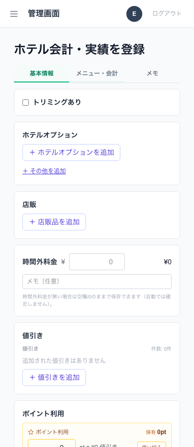

# ドッグサロン向け予約・顧客管理システム（moon fur）

`Production` ｜ 期間：2026-04〜（運用・改善継続中） ｜ 役割：要件定義・設計・実装・本番運用

> 本ドキュメントには、実在する飼い主名・電話番号・ペット名・LINE ID・売上の生データ・管理画面URLを含めていません。掲載画面はE2Eテスト用のダミーデータで撮影したものです。

## 概要

運営に関わるドッグサロン・ペットホテル **moon fur** で使っている予約・顧客管理システムです。店舗スタッフが使う管理画面と、飼い主が LINE から使う予約・マイページの両方を提供しています。美容室向けシステムをベースに、ペット業界の業務（1人の飼い主が複数の犬を連れてくる、犬種やサイズで料金と時間が変わる、ホテルは日付単位で預かる、など）に合わせて作り直しました。

- 公開サイト：https://moon-fur.com/ （サイトの予約ボタンから、このシステムの LINE 予約画面に遷移します）

## 背景 / 課題

- 顧客・ペット情報は Notion、予約は外部の予約サービスや LINE 配信ツールの予約機能に分かれていた
- 1人の飼い主に複数のペットがいて、ペットごとに犬種・体重・性格・注意点が違う
- 犬種・コース・サイズ・オプションで料金と所要時間が変わり、見積もりと予約枠の計算が複雑
- トリミング（時間単位）とホテル（日付単位）で予約の考え方が違う
- 外部サービスでは、再来店時にペット情報を引き継げない・複数頭をまとめて予約しにくい

## 利用者

| 利用者 | 主な利用内容 |
| --- | --- |
| オーナー・店舗責任者 | レポート確認、料金・キャパ・通知などの設定 |
| トリマー・スタッフ | 予約確認、施術記録、会計、ホテルの受け入れ |
| 飼い主 | LINE からの予約、予約・来店履歴・ペット・ポイントの確認 |

## 自分の役割

店舗の運営側と開発側の両方の立場で、現場との仕様決め、設計、実装、本番導入、運用中の不具合対応までを担当しています。

## 担当範囲

| 工程 | 内容 |
| --- | --- |
| 要件定義 | オーナー・店舗責任者との打ち合わせ、会議内容の仕様書化 |
| 画面設計 | 管理画面、LINE 予約（4ステップ）、マイページ |
| DB設計 | 飼い主・ペット・犬種・コース料金・ホテル・予約・会計・ポイント・通知など約80モデル（Prisma） |
| データ移行 | Notion からの顧客・ペット・来店データの取込、犬種表記の正規化 |
| 実装 | AIの支援を受けながら実装。料金計算・LINE連携を含む |
| テスト | Playwright による E2E テスト（ホテル会計、予約、LINE 画面の表示など） |
| 本番導入・運用 | VPS へのデプロイ、本番移行チェックリスト、現場からの不具合報告への対応 |

## 課題をどう整理したか

1. **会議の内容を仕様書にする**
   オーナー・店舗責任者と開発の3者で打ち合わせを行い、会議の文字起こしと、現場が使っていた予約画面のスクリーンショットをもとに「確定仕様書」を作りました。予約画面・ホテルの運用ルール・料金表示を、ここで一つずつ決めています。
2. **既存サービスの良い点と弱点を分ける**
   外部の予約サービスの画面を分析し、「迷わない直線的な予約導線」「仮予約 → 店舗確認 → 確定」は取り入れ、「再来店でもペット情報を毎回入力」「複数頭をまとめにくい」は改善点として設計に反映しました。
3. **ペット業界のデータ構造を整理する**
   飼い主とペットを分けて1対多で持ち、犬種（別名・MIX を含む）× コースで料金を持つマトリクス、体重記録、ホテルの日別キャパを別々のテーブルで整理しました。
4. **お金のルールの正本を決める**
   支払済みの判定・明細の合計・指名料・ホテル会計などについて、どのファイルが正本かを「不変条件」として文書化し、同じ業務ルールを別の場所にコピーしないようにしました。

## 主な意思決定

| 判断 | 理由 |
| --- | --- |
| LINE 予約の画面は、現場が「シンプルで分かりやすい」と評価していた既存の予約画面をベースにした4ステップ（日程 → 情報入力 → 確認 → 完了） | 現場と飼い主が慣れた操作を活かすため |
| 新規・長期未利用の顧客はホテルをネット予約できず、電話・LINE へ案内 | 初めての犬の受け入れは店舗が事前に確認する必要があるため |
| ホテルは日付単位で受け付け、料金は目安の幅だけを表示し、店舗の確認後に確定 | 毛量・体格・性格で料金が変わる実態に合わせるため |
| ホテルはトリミングとは別に、日別の最大頭数でキャパを管理 | ホテルとトリミングで受け入れの制約が違うため |
| 顧客・ペット・LINE ID・ポイントは自社システム側で持つ | 外部サービスに依存せず、将来の多店舗展開・外販に備えるため |
| 店舗固有の分岐をコードに書かず、店舗情報はDBの店舗テーブルから読む | 他の店舗でも使える構造にするため |
| 会計で正本のデータが特定できない場合は、処理を止めて確認を求める（fail-closed） | 誤った金額を確定させないため |
| 本番デプロイは専用スクリプト1本に限定し、同じサーバーの美容室システムに触れないようにガード | 運用中の2店舗のシステムを同時に守るため |

## システム / 業務設計

## 主な機能

**店舗の管理画面**
- 予約管理：トリミング / ホテルの切り替え、日表示・月表示、30分単位の受付数の調整、仮予約リクエストの確認
- 顧客（飼い主）・ペット管理：複数ペット、体重記録、健康記録、写真、重複の統合
- マスタ：犬種（別名・MIX の正規化）、コース、犬種 × コースの料金マトリクス、ホテル料金・キャパ、オプション、スタッフのシフト
- 会計：トリミング・ホテル・オプション・店販・時間外料金・値引き・ポイント利用・複数の支払方法
- ホテル：宿泊と一時預かり、会計台帳、会計確認の作業一覧
- ポイント・マイレージ・特典の管理、来店時のQR読み取り
- 通知：LINE・メールのテンプレート、リマインド、店舗スタッフへの通知先
- レポート：スタッフ別・犬種別・ホテル・オプション・ペット・曜日別、来店周期を過ぎたペットや失客リスクの抽出（ルールベース）、CSV出力
- 監査ログ

**飼い主向け（LINE / Web）**
- LINE（LIFF）からの予約：複数のペットをまとめて予約、コースの料金と時間を表示
- マイページ：予約一覧、来店履歴、ペット情報、ポイント・特典
- PC ブラウザ向けの LINE ログイン
- ホテルの予約リクエスト

## 技術構成

| 分類 | 技術 |
| --- | --- |
| フレームワーク | Next.js 16（App Router / Server Actions）、React 19 |
| 言語・UI | TypeScript、Tailwind CSS v4、Recharts |
| DB・ORM | PostgreSQL、Prisma 6 |
| 認証 | iron-session、bcryptjs（スタッフ）、LINE Login（OAuth）・LIFF（飼い主） |
| LINE連携 | @line/liff、Messaging API（プッシュ通知） |
| メール | Nodemailer |
| 画像 | sharp |
| 入力検証 | Zod |
| データ取込 | csv-parse、xlsx、iconv-lite |
| テスト | Playwright（E2E） |
| 運用 | VPS、PM2、Nginx、専用デプロイスクリプト |

## 導入・運用

- **移行**：Notion の顧客・ペット・来店データを取込み、取込ルールと再取込計画を文書化。本番移行はチェックリストに沿って実施
- **現場からの不具合への対応**：たとえば2026年8月には、ホテル会計について現場から寄せられた複数の報告を、1件ずつ「原因・修正・テスト」の表で管理しました。実際の報告内容をテストの前提データにし、泊数の計算、複数の支払方法、スマートフォンでの表示崩れなどを恒久的に修正しています
- **安定化**：2026年9月に、業務ルールの正本・不変条件・回帰テストの対応表を整備し、金額のデータが欠けているときは処理を止める（fail-closed）ように統一
- **デプロイ**：本番反映は専用スクリプトのみで行い、実行前後にデータ件数を確認、暗号鍵の有無を検査、同居する美容室システムの状態を監視

## 成果

- 店舗の予約・会計・ホテル・顧客管理を、このシステムで本番運用している
- 公開サイトの予約ボタンから LINE 予約までを、自社システムでつないだ
- 顧客・ペット・ポイントのデータを外部サービスに依存せず、自社で持てるようになった

※ 予約数・作業時間などの定量効果は計測していないため記載していません。

## 現在の状態

- 本番運用中（店舗の管理画面と、飼い主向けの LINE 予約・マイページ）
- 運用で見つかった課題を受けて、安定化と改善を継続中

## 公開可能な画面・リンク

- 公開サイト：https://moon-fur.com/
- 画面：E2Eテスト用ダミーデータで撮影したホテル会計画面（上記）
- ソースコード：非公開リポジトリ

## セキュリティ / 非公開情報について

- スタッフはログイン必須、権限ごとに操作を制限。重要な操作は監査ログに記録
- LINE ログインは state パラメータを使って CSRF を防止
- LINE の Channel Secret・アクセストークン、DB接続情報、暗号鍵は環境変数で管理し、リポジトリに含めない
- 本ポートフォリオには、飼い主名・電話番号・ペット名・LINE ID・売上の生データ・管理画面URLを載せていません

## 学び

- **現場の言葉を仕様に落とす場を作ると、手戻りが減る。** 3者の会議を確定仕様書にまとめたことで、ホテルの運用ルールのような「コードだけでは決められないこと」を先に決められました。
- **業務ルールは一か所に。** お金に関わるルールが複数の画面に散らばると、表示と会計がずれます。正本を決めて文書化することが、運用中の不具合を減らす一番の近道でした。
- **現場からの報告はテストにする。** 実際の報告内容をテストの前提データにすることで、同じ不具合の再発を防げています。
