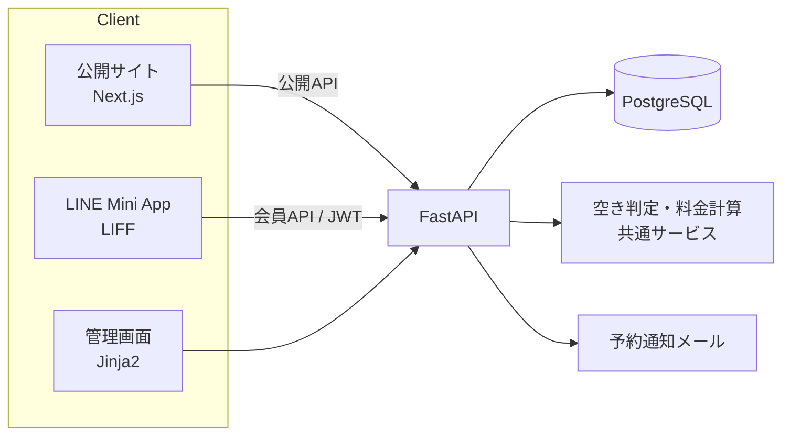

# レンタカー予約・会員・管理システム

`Production` ｜ 期間：2026-04〜 ｜ 役割：要件整理・設計・実装・VPS運用

> 本ドキュメントは実案件を匿名化したケーススタディです。事業者名・顧客情報・免許証情報・予約番号・契約情報・本番URL・管理画面URL・サーバ情報は含めていません。

## 概要

レンタカー事業向けに、**公開サイト（Web予約）・店舗の管理画面・LINE 上の会員アプリ（Mini App）・API** を一つのバックエンドで提供するシステムです。現在は1店舗で運用しており、将来の多店舗展開を見据えたデータ構造にしています。

## 背景 / 課題

- 車両ごとの貸出状況と予約を横断して把握しづらく、空き確認に手間がかかる
- 車種・期間・オプション・保険・繁忙期によって料金が変わり、手計算ではミスが起きやすい
- 電話・店頭中心の受付で、オンライン予約と会員の導線が整っていなかった
- 旧システムの予約履歴や顧客データを引き継ぐ必要があった
- 免許証情報や契約書類など、取り扱いに特に注意が必要な情報を扱う

## 利用者

| 利用者 | 主な利用内容 |
| --- | --- |
| 店舗スタッフ・管理者 | 予約・車両・顧客・入金・契約の管理、レポート確認 |
| Web で予約する利用者 | 車両検索、空き確認、料金の目安確認、予約 |
| LINE 会員 | LINE ログイン、予約の確認、マイページ、領収書 |
| 法人顧客 | 法人向けの問い合わせ・契約 |

## 自分の役割

事業者と一緒に業務フローを整理し、設計・実装から VPS での本番運用・障害対応までを担当しています。

## 担当範囲

| 工程 | 内容 |
| --- | --- |
| 課題整理・要件定義 | 予約・貸出・返却・入金の流れの整理、料金ルールの整理 |
| 画面設計 | 公開サイト、管理画面、LINE Mini App の画面と導線 |
| DB設計 | 店舗・車両・車両カテゴリ・予約・オプション・保険・契約・会員など（SQLAlchemy / Alembic） |
| API設計 | 公開API・会員API・管理APIの分離 |
| 実装 | AIの支援を受けながら実装。料金計算・空き判定・LINE連携を含む |
| データ移行 | 旧システムの予約履歴・車両データの取込と変換 |
| 本番導入・運用 | Docker Compose による VPS デプロイ、Nginx・SSL 設定、DBリストア手順の整備 |

## 課題をどう整理したか

1. **API ファーストの構成にする**
   一つの FastAPI アプリで、管理画面（サーバー側でHTMLを生成）と JSON の公開API を提供し、Next.js の公開サイトは公開APIだけを使う構成にしました。予約のルールをバックエンドの一か所にまとめるためです。
2. **空き判定を一か所に集約する**
   運用中に「画面に表示される空き」と「実際に予約できるか」がずれる不具合が見つかりました。原因は、早期返却を考慮した終了時刻の計算が複数の場所で別々に書かれていたことでした。これを共通サービスにまとめ、車両一覧・空き検索・予約作成・稼働カレンダーのすべてが同じ判定を使うように直しました。
3. **料金計算をサービス層に分ける**
   基本料金、オプション、保険、繁忙期料金などをサービス層の料金計算にまとめ、画面ごとに計算しないようにしました。
4. **会員の入口を LINE にする**
   利用者にとって身近な LINE をログインの入口にし、アプリのインストール不要で予約確認やマイページを使えるようにしました。

## 主な意思決定

| 判断 | 理由 |
| --- | --- |
| 管理画面は Jinja2 のサーバーレンダリング、公開サイトは Next.js に分ける | 管理画面は早く確実に作り、集客面の公開サイトは表現力と SEO を重視するため |
| LINE ログインはサーバー側で LINE のトークンを検証し、独自の JWT とリフレッシュトークンを発行 | 会員APIの認証をバックエンドで一元管理するため |
| 免許証画像のOCRは外部APIを使わず、サーバー内の Tesseract で処理 | 個人情報を外部サービスに送らないため |
| 免許証情報へのアクセスは監査ログに記録 | 機微情報の取り扱いを追跡できるようにするため |
| DB変更は Alembic のマイグレーションで管理 | 本番DBの変更履歴を残し、再現できるようにするため |

## システム / 業務設計

## 主な機能

**公開サイト**
- 車両一覧・車両クラス別の空き検索、料金の目安、Web予約
- 店舗・料金・FAQ・記事・法人向け・長期利用・キャンペーンのページ、規約類

**会員（LINE Mini App / マイページ）**
- LINE ログイン、会員登録・連携
- 予約一覧・予約詳細、領収書の表示
- マイレージ

**管理画面**
- ダッシュボード（KPIサマリー）
- 予約の作成・編集・キャンセル、予約ブロック
- 車両・車両カテゴリ・オプション・保険の管理、車両の稼働カレンダー
- 顧客管理（重複統合・統合ログ）、法人顧客
- 入金・売上管理、契約書テンプレート・契約関連書類
- 繁忙期料金、会員特典の設定
- お知らせ・記事・FAQ・ポリシーの管理
- レポート（売上・KPI・広告・車両ごとの収支）、LINE導線のクリックログ
- 車両の仕入・販売（古物台帳・書類PDF）の管理モジュール（拡張中）

## 技術構成

| 分類 | 技術 |
| --- | --- |
| バックエンド | Python、FastAPI、Uvicorn、SQLAlchemy 2.0、Alembic、Pydantic、Jinja2 |
| 認証 | セッション認証（管理画面）、PyJWT（会員API）、bcrypt |
| 画像・OCR | Pillow、Tesseract（pytesseract）、OpenCV |
| フロントエンド | Next.js 16、React 19、TypeScript、Tailwind CSS v4 |
| LINE連携 | LINE Login、LIFF（@line/liff） |
| DB | PostgreSQL |
| インフラ | VPS、Docker Compose（DB・API・公開サイト）、Nginx（リバースプロキシ・SSL終端）、Certbot |

## 導入・運用

- VPS 上で Docker Compose により、DB・API（管理画面）・公開サイトの3コンテナを運用
- Nginx をリバースプロキシとして配置し、SSL 証明書は Certbot で自動更新
- デプロイ手順書・DBリストア手順を文書化し、再現できる状態にしている
- 旧システムの予約履歴を取り込み、新システムの予約として扱えるように変換

## 成果

- 公開サイトからの Web 予約と、管理画面での予約・車両・入金管理を本番で運用している
- 空き判定を共通化したことで、表示と予約可否のずれを解消した
- LINE を入口にした会員導線（ログイン・予約確認・領収書）を実装した

※ 予約数や売上の変化などの定量効果は、このポートフォリオでは公開していません。

## 現在の状態

- 公開サイトと管理画面は本番運用中
- LINE Mini App は 2026-05 時点で第1段階の実装が完了し、正式リリースの直前（最新の状況は面談時に説明）
- 車両売買の管理機能を拡張中

## 公開可能な画面・リンク

- ソースコード：非公開
- 画面：本番データを含むため未掲載。ダミーデータでの撮影を予定しています（[screenshots/README.md](../screenshots/README.md)）

## セキュリティ / 非公開情報について

- 免許証情報・契約情報・会員情報は特に機微な情報として扱い、権限管理とアクセスログで保護
- 免許証のOCRは外部APIを使わない
- LINE の Channel Secret・トークン、DB接続情報、SMTP 認証情報は環境変数で管理し、リポジトリに含めない
- 本ポートフォリオには、事業者名・顧客情報・本番URL・サーバ情報を載せていません

## 学び

- **同じルールを複数の場所に書くと、いつか必ずずれる。** 空き判定のずれは、ルールを一か所にまとめることでしか根本的に解決できませんでした。
- **利用者の入口は、利用者が普段使っているものにする。** LINE を入口にしたことで、アプリのインストールなしで会員機能を提供できました。
- **機微情報は「外に出さない設計」から考える。** OCR を外部に頼らないなど、個人情報の扱いを最初の設計判断に含めました。
