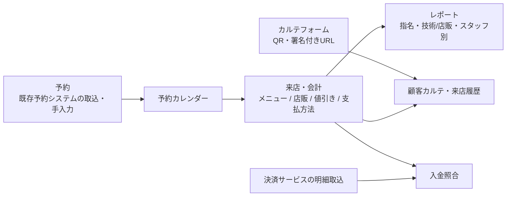

# 美容室向け業務管理システム（moon hair）

`Production` ｜ 期間：2026-03〜（運用・改善継続中） ｜ 役割：要件整理・設計・実装・本番運用

> 本ドキュメントには、実在する顧客名・スタッフ名・売上の生データ・本番URLを含めていません。

## 概要

運営に関わる美容室 **moon hair** で使っている社内業務システムです。予約、来店・会計、顧客、スタッフ、メニュー・商品・値引きのマスタ、レポートを一つのデータベースで管理しています。Notion などに分散していた業務データを移行し、日々の予約・会計・顧客対応をこのシステムで回しています。

## 背景 / 課題

- 顧客・来店・売上の情報が Notion、既存の予約システム、Googleフォーム（カルテ回答）、決済サービスの管理画面に分かれていた
- 同じ顧客が別表記で重複していたり、スタッフ名の表記がゆれていたりして、履歴を正しくたどれない
- 「指名あり/なし」「技術/店販」「値引き」を含めたスタッフ別の売上を正しく集計するのが手作業で、担当者に依存していた
- 決済サービスの入金明細と来店会計の突き合わせに手間がかかっていた

## 利用者

| 利用者 | 主な利用内容 |
| --- | --- |
| オーナー・管理者 | レポート確認、マスタ・ユーザー管理、データ修正 |
| スタイリスト・スタッフ | 予約確認、来店・会計の登録、顧客情報の参照 |
| 経理 | 売上・決済明細の確認と照合 |
| 来店客 | QRコードから開くカルテ（顧客情報）フォームへの回答 |

ログインユーザーの権限は「オーナー / 管理者 / スタッフ / 経理」の4つです。

## 自分の役割

店舗の運営側と開発側の両方の立場で、業務の整理からシステムの本番運用まで一人で担当しています。

## 担当範囲

| 工程 | 内容 |
| --- | --- |
| 課題整理・要件定義 | 現場の業務フロー整理、既存データの棚卸し、優先順位付け |
| 画面設計 | 予約カレンダー、会計、顧客、レポートの画面と操作導線 |
| DB設計 | 予約・来店・明細・値引き・支払・顧客・スタッフなど約30モデル（Prisma） |
| データ移行 | Notion・既存予約システム・Googleフォーム回答・決済明細の取込スクリプト |
| 実装 | AIの支援を受けながら実装。仕様の判断とコードの確認は自分で行う |
| テスト | 金額計算・値引き配分・日付処理などを Vitest でテスト |
| 本番導入・運用 | VPS へのデプロイ、バックアップ・リリース手順の整備、運用中の改善 |

## 課題をどう整理したか

1. **「予約」と「来店・会計」を分けて持つ**
   予約（Appointment）と、実際の来店・会計（Visit）を別のデータとして持ち、予約カレンダー上でまとめて表示するようにしました。予約の変更と、確定した売上を混ぜないためです。
2. **移行と初期設定を分ける**
   マスタの初期投入（seed）と、過去データの移行（import）を別の仕組みにしました。移行は dry-run で事前確認でき、予約番号などで重複を除くため、何度実行しても結果が変わりません。
3. **名寄せを仕組みにする**
   顧客の重複候補の検出・統合・統合ログ、スタッフ名の別名テーブルを用意し、表記ゆれを後から直せるようにしました。
4. **売上の正本を一か所にする**
   値引きは「種別＋金額」だけを入力し、明細への配分はサーバー側で自動計算します。レポートはこの配分結果をもとに「指名あり/なし × 技術/店販」で集計します。
5. **データの異常を見える化する**
   「担当者未確定」「明細なし」「明細合計のズレ」「重複の疑い」を一覧で確認できる画面を作り、日々のデータ品質をチェックできるようにしました。

## 主な意思決定

| 判断 | 理由 |
| --- | --- |
| DBスキーマは `schema.prisma` だけを正本とし、変更は必ずマイグレーション経由にする。本番DBは手で直接変更しない | 本番運用中の店舗データを壊さないため |
| 値引きの入力を「種別＋金額」だけに簡素化し、配分はサーバーに一本化 | 現場の入力負担を減らしつつ、集計の正確さを担保するため |
| 新しい売上分類の計算を入れても、過去期間の既存レポートの数値は変えない | 過去の数字との比較を崩さないため |
| 顧客の物理削除は、履歴のない顧客に限りオーナー/管理者だけに許可 | 売上履歴の欠落と誤操作を防ぐため |
| 誕生日などは日付型で保存し、タイムゾーンによる日付ずれを防止 | 実運用で起きた日付ずれの再発防止 |

## システム / 業務設計

## 主な機能

- **ダッシュボード**：店舗内の掲示板、売上サマリー
- **予約カレンダー**：予約と来店を統合表示、ドラッグでの予約移動
- **来店・会計**：メニュー・店販商品・値引き・支払方法の登録
- **顧客管理**：顧客一覧・詳細・来店履歴、重複候補の検出と統合
- **カルテフォーム**：署名付き・有効期限付き・使い切りのURL（QRコード）から来店客が回答し、顧客情報に反映
- **レポート**：新規顧客数、リピート率、客単価、指名率、施術時間あたり売上、店販比率、スタッフランキング、支払方法別売上、月別推移、顧客ランキング
- **入金照合**：決済サービス（AirPay・PayPay 等）の明細を取り込み、来店会計と突き合わせ
- **データ監査**：担当者未確定・明細なし・金額ズレ・重複疑いの一覧
- **マスタ・ユーザー管理**：メニュー、商品、値引き種別、カテゴリ、予約経路、支払方法、スタッフ、ログインユーザーと権限

## 技術構成

| 分類 | 技術 |
| --- | --- |
| フレームワーク | Next.js 16（App Router / Server Components / Server Actions）、React 19 |
| 言語・UI | TypeScript、Tailwind CSS v4、Recharts |
| DB・ORM | PostgreSQL、Prisma 6 |
| 認証 | iron-session、bcryptjs、ロール別の画面・操作制御 |
| 入力検証 | Zod |
| データ取込 | csv-parse、xlsx、iconv-lite（文字コード変換） |
| テスト・品質 | Vitest、ESLint、TypeScript 型チェック |
| 運用 | VPS、PM2、Nginx |

## 導入・運用

- **移行**：Notion の顧客・来店・明細データを取込スクリプトで移行（ロードマップの Phase 0 として完了）。既存予約システムの予約データ、Googleフォームのカルテ回答も取込
- **本番運用**：VPS 上で稼働。同じサーバーでドッグサロン向けシステムも動いているため、互いに影響しないデプロイ手順にしている
- **運用ルール**：リリース前チェックリスト、バックアップ・再取込の手順書、DB変更ルールをリポジトリに文書化
- **運用中の改善**：現場の声を受けて会計画面の値引き入力を簡素化し、スタッフ売上の集計を既存レポートと互換のまま正確にする、といった改善を継続

## 成果

- 予約・会計・顧客管理の日常業務を、このシステムで運用している
- 分散していた過去の顧客・来店データを一つのDBに移行し、来店履歴をたどれるようになった
- 指名・技術/店販・値引きを含むスタッフ別の売上を、レポート画面で確認できるようになった

※ 作業時間の削減率などの定量効果は計測していないため記載していません。

## 現在の状態

- 本番運用中（自店舗での安定運用フェーズ）
- 今後の計画（ロードマップ）：カルテ機能の拡充、勤怠・給与、複数店舗対応、他店舗への提供（マルチテナント）

## 公開可能な画面・リンク

- ソースコード：非公開リポジトリ（面談時に画面共有で説明可能）
- 画面：本番データしかないため、現時点では未掲載。ダミーデータ環境での撮影を予定しています（[screenshots/README.md](../screenshots/README.md)）

## セキュリティ / 非公開情報について

- ログイン必須。パスワードはハッシュ化して保存し、権限ごとに操作を制限
- カルテフォームのURLは署名付き・有効期限付き・一度だけ使えるトークンで発行
- 本番DBの変更はマイグレーション経由のみ、変更前にバックアップを取得
- 本ポートフォリオには、顧客名・スタッフ名・売上の生データ・管理画面URL・サーバ情報を載せていません

## 学び

- **現場の業務フローを理解しないと、使われるシステムにはならない。** 受付・会計の流れを把握したうえで画面を作ったことで、日常業務で迷わず使える形にできました。
- **予約・顧客・売上は別々に見えて、実際には強くつながっている。** 「予約 → 来店 → 会計 → 履歴」をデータでつなぐことで、二重入力をなくし、スタッフ別の集計を自動化できました。
- **本番データを扱う以上、「壊さない仕組み」が機能と同じくらい大切。** マイグレーションのルール、バックアップ、データ監査画面を最初から用意したことで、運用しながら安全に改善を続けられています。
