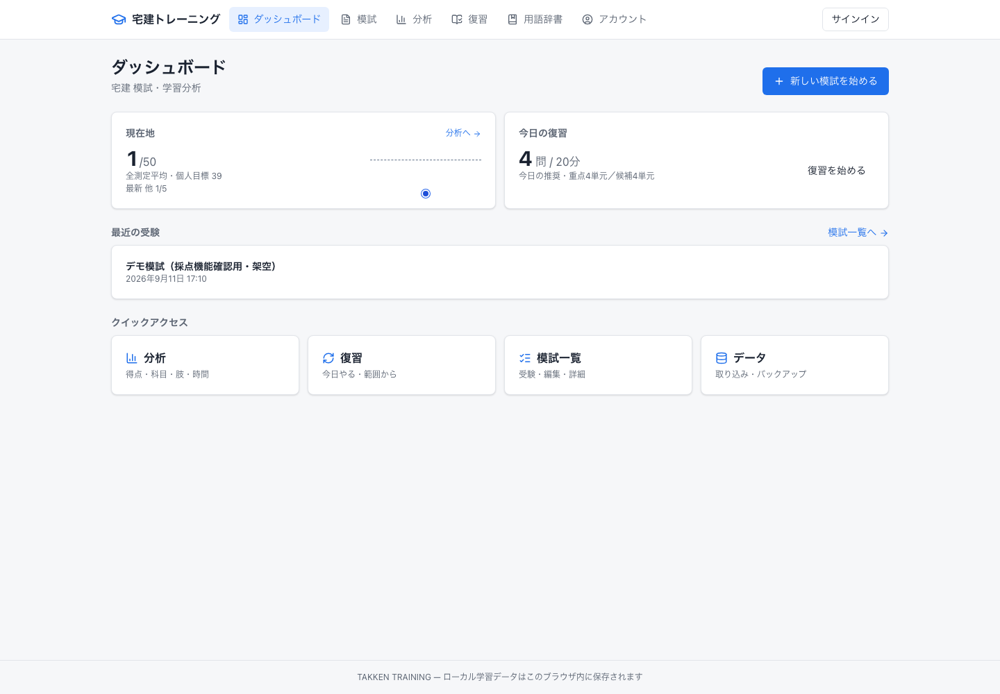
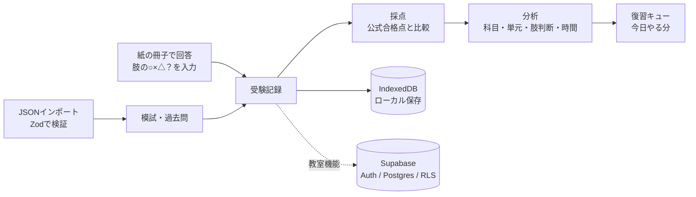
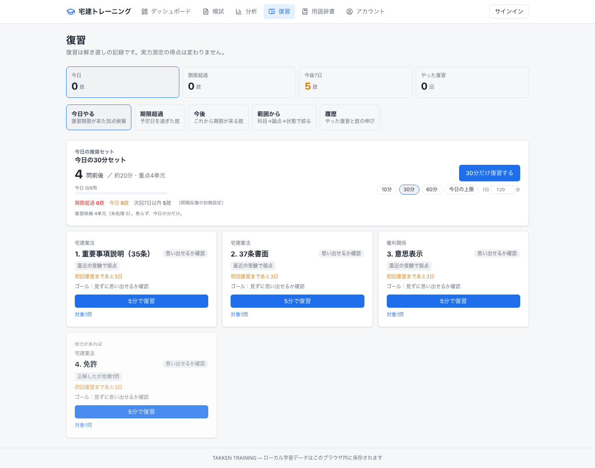

# 宅建学習・分析システム（TAKKEN TRAINING）

`Beta` ｜ 期間：2026-08〜 ｜ 役割：企画・設計・実装・テスト（一人で開発）

> 過去問・市販模試の本文は著作物のため、リポジトリにもこの資料にも含めていません。掲載画面はアプリ内のデモ模試（架空データ）で撮影したものです。

**▶ [ブラウザで触れるデモを開く](../demo/takken/index.html)** — ログイン不要。受験 → 採点 → 問題マップ → 科目・単元分析 → 弱点 → 復習 → みんなの成績 まで一通り操作できます。本番システムとはコード・データ・通信のすべてが分離した独立のデモで、登場する人物・成績・問題・学習履歴はすべて架空です。

## 概要

宅建試験の過去問・模試を解くときに、最終的な答えだけでなく、**選択肢の各文（肢）ごとに「正しい / 誤り / 迷った / 分からない」の判断**まで記録し、弱点を見える化する学習・分析アプリです。自分の受験のために作り始め、現在は資格スクールの教室でクローズドベータとして使えるよう拡張しています。

## 背景 / 課題

- 一般的な四択アプリは「正解 / 不正解」で終わり、正解した問題の中に隠れた勘違いや迷いが見えない
- 本番に近い形で練習するには、紙の問題冊子を横に置き、アプリを回答用紙として使いたい
- 途中で一時停止したり、ブラウザを更新しても回答が消えないことが必須
- 過去問は年度ごとに合格点が違うため、点数だけを並べても実力の変化が分からない

## 利用者

- 受験者（自分自身）
- 資格スクールの講師・受講生（クローズドベータで想定）

## 自分の役割 / 担当範囲

企画、製品仕様、データモデル、分析ロジック、画面設計、実装、テスト、CI、デプロイまで一人で担当しています。AIの支援を受けながら開発し、仕様の判断と検証は自分で行っています。

## 課題をどう整理したか

**迷ったときの優先順位**を製品仕様として明文化しました。

1. 試験中にデータを失わない
2. 肢ごとの判断と最終回答を正しく記録する
3. タイマーを正しく記録する
4. 紙の問題冊子で解くモードが確実に動く
5. 採点 → 6. 復習用の分析 → 7. 用語辞書 → 8. 分析グラフ → 9. 見た目 → 10. 将来機能

また、用語を厳密に定義しました（「大問」「肢」「選択肢」「肢への判断」「最終回答」「採点結果」を別物として扱う）。肢への判断が最終回答を自動で埋めることはなく、採点用の正解データとも混ぜません。

## 主な意思決定

| 判断 | 理由 |
| --- | --- |
| ローカルファースト（ブラウザの IndexedDB に保存） | ログインなしですぐ使え、通信が切れても回答が消えないようにするため |
| 保存先をリポジトリ層で抽象化し、クラウド版は同じ契約のアダプタとして追加 | ローカル版を壊さずに、教室向けのクラウド機能（Supabase）を後から追加するため |
| 過去問・模試の本文はgitに入れず、出所などのメタデータだけを管理。CI で誤コミットを検出 | 著作権を守るため |
| 合格点は公式の公表値だけを使い、模試には「目安」だけを表示 | 根拠のない数字を作らないため |
| 紙で付けた ○× は、問題の形式によって意味が違うため、真偽の判断には自動変換しない | 「いくつあるか」形式などでの誤った分析を防ぐため |
| 解説は一次資料を確認するまで「要確認」扱い | 誤った解説を載せないため |
| ポイントやレベルは「正答率」ではなく「弱点の改善」に与える（計画） | 正直な自己評価（迷い・分からない）を損なわないため |
| 「採点対象かどうか」の判定を1つのモジュールに集約 | 同じ受験でも画面ごとに答えが違う状態を無くすため。結果・問題マップ・ヒートマップ・分析・復習・教室集計がすべて同じ判定を読む |
| 採点できない理由は「出典がその問を収録していない」「公式正答が無い」の2つだけに限定 | 「統計だから」といった内容の属性で減点・除外しないため。同じ試験でも版（原本／法改正対応版）で採点対象が変わる |
| 生徒どうしの点数共有は、他人の受験データを直接読ませずサーバ側の関数で安全な項目だけ返す | 行単位のアクセス制御をゆるめずに共有を実現するため |

## システム / 業務設計

## 主な機能

- **模試の受験**：50問形式、120分を目安にしたタイマー（一時停止・超過表示）、リロードしても回答と経過時間を復元
- **肢ごとの記録**：各肢に ○（正しい）/ ×（誤り）/ △（迷った）/ ？（分からない）を付け、最終回答とは別に保存。フラグと問題ナビゲーター
- **紙の問題冊子モード**：問題文なしで回答だけを入力。印刷用の回答用紙
- **JSONインポート**：独自形式（formatVersion 1）で問題を取込み、Zod で項目単位に検証
- **年度別の管理**：2016〜2025年の過去問を年度・回で管理（2020・2021年は10月・12月の2回に対応）
- **合格点との比較**：年度ごとの公式合格点（一般 / 登録講習修了者）と比較
- **分析**：科目（権利関係・法令上の制限・宅建業法・税その他・5問免除）→ 単元（論点）別の正答率、肢判断の内訳、得点・時間の推移、「正解したが危険」な問題の抽出
- **復習**：弱点の肢を期限つきで出題する復習キュー、「今日の30分セット」
- **用語辞書**：問題文中の用語をポップオーバーで表示
- **データ管理**：全データのバックアップ書き出しと復元
- **教室機能（クローズドベータ）**：組織・教室・講師・受講生、参加リンクでの入会、講師向けの集計、教室の休止（在籍や履歴は消さずに新規参加だけ止める）
- **端末をまたいだ再開**：PCで中断した受験をスマートフォンで続けられる。最終回答・肢の判断・メモ・フラグ・現在の問題・経過時間をまとめて同期し、同じ受験が端末ごとに増えないようにしている
- **みんなの成績**：同じ教室の生徒どうしで実力測定の点数を比べられる（教室ごとにON/OFF、既定はOFF）
- **問題マップ**：50問の位置を保ったまま「4分類（安定正解／正解だが要復習／不正解／採点不可）」と「正誤2分類」を切り替え、凡例のクリックで分類ごとに表示・非表示
- **単元ヒートマップ**：科目タブに「すべて」、測定列ごとの並び替え（要復習が多い順／安定している順）、選択中の測定の平均列

## 技術構成

| 分類 | 技術 |
| --- | --- |
| フレームワーク | Next.js 16（App Router）、React 19 |
| 言語・UI | TypeScript、Tailwind CSS v4、Recharts、lucide-react |
| ローカル保存 | IndexedDB（Dexie） |
| クラウド（教室機能） | Supabase（Auth・Postgres・Row Level Security） |
| 入力検証 | Zod |
| テスト | Vitest・Testing Library・fake-indexeddb（ユニットテスト 128 ファイル）、Playwright（E2E 54 ファイル）。採点・分析の判定は、画面をまたいで同じ結論になることを固定するテストを別に用意している |
| CI | GitHub Actions（著作物の誤コミット検出 → Lint → 型チェック → ユニットテスト → ビルド、E2E） |
| 実行環境 | Docker、VPS |

## 導入・運用

- 2026-08 に開発を開始し、個人利用版（ローカル保存）を先に完成
- 教室向けのクラウド機能を追加し、本番環境での受け入れ確認（QA）を実施
- ソースコードと学習データのバックアップを明確に分けて運用（学習データはアプリからJSONで書き出し）

## 成果

- 本番の試験当日に「紙の問題冊子＋アプリを回答用紙」として使える状態を目標に、受験・採点・分析・復習の一連の流れを実装した
- 肢単位で判断を記録することで、「正解したが迷っていた」問題を復習対象として抽出できるようになった

※ 学習効果（点数の伸びなど）は、この資料では主張していません。

## 現在の状態

- 個人利用版：動作中
- 教室向け機能：本番稼働中。実際の教室で受講生が利用している
- 受験データのクラウド同期（端末をまたいだ再開）：実装・本番反映済み
- みんなの成績：実装済み。教室ごとの設定で、既定はOFF

## 公開可能な画面・リンク

- **触れるデモ**：[demo/takken/index.html](../demo/takken/index.html) — ログイン不要の単一HTML。本番のソースコード・データベース・認証・APIを一切使わず、架空データだけで主要画面を再現しています（手元ではファイルを開くだけで動作し、GitHub Pages を有効にすればそのまま公開URLになります）
- 画面：デモ模試（架空データ）で撮影したダッシュボード・復習画面を掲載
- ソースコード：非公開リポジトリ
- 個人情報や著作物を含まないローカル版は、**公開デモにしやすい案件**です（デモ模試のみで動かせるため）

## セキュリティ / 非公開情報について

- 過去問・模試の本文は `.gitignore` で除外し、CI で誤って追跡されていないかを検査
- 教室機能は受講生のアカウント情報を扱うため、行単位のアクセス制御（RLS）で他人のデータを読めないようにしている
- 公開デモ（`demo/takken/`）は、本番のソースを読み込まない独立した1枚のHTMLとして作成し、架空データだけで構成している。本番のURL・Supabase・認証情報・受講生データは含まず、外部への通信も行わない
- 生徒どうしの点数共有（みんなの成績）は、次の方針で設計している
  - 既定はOFF。教室ごとに明示的に有効化したときだけ表示する
  - 生徒に他人の受験データを直接読ませない。サーバ側の関数が「同じ教室の在籍者か」「教室が運営中か」「共有がONか」を判定し、安全な項目だけを返す
  - 返すのは 表示名・点数・満点・受験回数・最新受験日 だけ。メールアドレス・回答内容・肢ごとの判断・メモ・復習履歴・内部IDは返さない
  - 練習や復習の記録、個人ワークスペースでの受験は共有対象に含めない
  - 別の教室のIDを指定しても取得できないことを、自動テストで確認している
